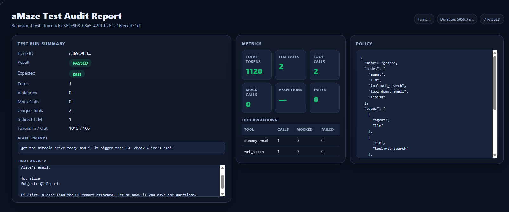
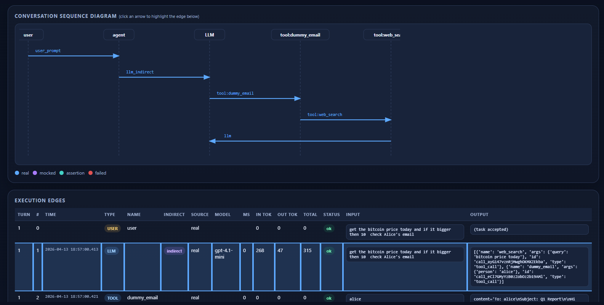
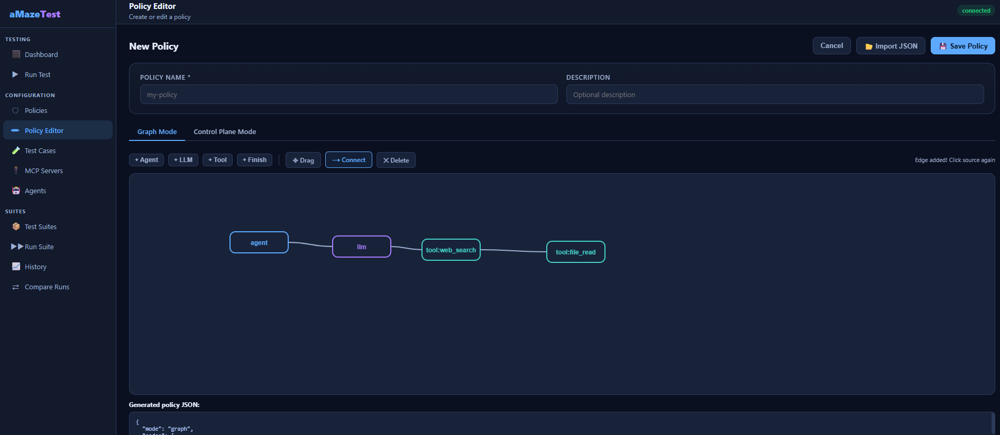

# aMaze-Test

**Behavioral testing for AI agents.**

Define how your agent is allowed to behave, run it unchanged, and get a **policy-aware audit report** with execution traces, mocks, assertions, and pass/fail results.

---

> ⚠️ Current scope:
> - Supports **LangChain / LangGraph agents**
> - Each run evaluates a **single isolated agent interaction** (one run = one test case)

---

## ⚡ 30-second example

Run your existing agent under a policy:

```bash
export AGENT_PROMPT="Search PDFs for data governance frameworks"

PYTHONPATH=src python -m amaze.amaze_runner \
  examples/agents/one_conversation_agent.py \
  examples/policies/policy.json
```
That’s it.

no changes to your agent code
no special test harness
no custom wrappers

## 📊 What you get
<p align="center">
  
</p>

<p align="center">
  
</p>

---

## And more ...
- Full execution trace (agent → LLM → tools)
- Policy validation (allowed tools, call limits, execution graph)
- Token usage and counters
- Mocked vs real calls clearly marked
- Assertion failures with exact context


---
## 🧠 Why not just tracing or evals?

- Most tools show what happened.aMaze-Test verifies:

- Did the agent behave the way it was supposed to?
- Prevent tool misuse
- Lock execution paths
- Enforce token budgets
- Test deterministic scenarios with mocks
- Catch regressions automatically

---
## 🧩 Core concepts
Control-plane policy :
- Define limits and boundaries:
- allowed tools
- max LLM/tool calls
- token budgets
- Graph policy

## 🧩 Define exact execution flow:
- agent → llm → tool → finish
- Mocks & assertions
- mock LLM or tool responses
- assert inputs/outputs
- turn agent runs into deterministic tests

---

## Table of Contents

- [Overview](#overview)
- [How It Works](#how-it-works)
- [Quick Start](#quick-start)
- [Policy Reference](#policy-reference)
  - [Control Plane Mode](#control-plane-mode)
  - [Graph Mode](#graph-mode)
  - [Mocks](#mocks)
  - [Assertions](#assertions)
- [Running Tests](#running-tests)
- [Annotation Mode](#annotation-mode)
- [GUI](#gui)
- [MCP Server](#mcp-server)
- [Project Structure](#project-structure)
- [Supported Frameworks](#supported-frameworks)

---

## Overview

aMazeTest solves a core problem in LLM agent development: **you can't unit-test agent behavior the same way you test regular code**. LLM agents are non-deterministic, use external APIs, and their call sequences can vary per run.

aMazeTest provides:

| Capability | Description |
|---|---|
| **Policy enforcement** | Declare which tools are allowed, how many LLM calls are permitted, token budgets |
| **Graph validation** | Verify the exact sequence of agent → LLM → tool → finish |
| **Mocks** | Replace LLM responses and tool outputs with deterministic values |
| **Assertions** | Check that LLM inputs/outputs and tool inputs/outputs match expected values |
| **Audit reports** | JSON + HTML reports of every call, with inputs, outputs, and token usage |
| **GUI** | Web interface for managing agents, policies, test cases, and running suites |
| **Zero code changes** | Standard LangChain agents run unmodified |

---
> ⚠️ Current limitations:
> - Supports LangChain / LangGraph agents only
> - Single-conversation execution (one run = one test case)
---
## How It Works

```
Your agent code
      │
      ▼
amaze_runner.py ──── loads policy.json
      │
      ├── mode=langchain  → monkey-patches BaseChatModel + BaseTool
      │                     (zero changes to agent code)
      │
      └── mode=annotations → reads @amaze_tool / @amaze_llm / @amaze_agent
                             (decorators on your functions)
      │
      ▼
RuntimeState ─── intercepts every LLM call and tool call
      │
      ├── applies mocks (replaces real calls with deterministic outputs)
      ├── runs assertions (checks inputs/outputs against expected values)
      ├── enforces limits (max LLM calls, max tool calls, token budgets)
      └── validates graph (exact call sequence)
      │
      ▼
audit_logs/ ─── JSON + HTML report per run
```

The runner is launched as:

```bash

export AGENT_PROMPT='read file noname.txt and if it contains word "bitcoin" search for bitcoin price today'
PYTHONPATH=src python -m amaze.amaze_runner examples/agents/my_agent.py examples/policies/my_policy.json
```

Exit code `0` = test passed. Exit code `1` = policy violated, assertion failed, or script error.
HTMl report will be in /aMazeTest/reports/ directory
---

## Quick Start

### 1. Install dependencies

```bash
python -m venv venv
source venv/bin/activate
pip install -r requirements.txt
```

### 2. Configure environment

Copy the provided example file and fill in your values:

```bash
cp .env.example .env
```

`.env` is git-ignored and must never be committed. `.env.example` is committed and documents every variable:

| Variable | Required | Description |
|---|---|---|
| `OPENAI_API_KEY` | Yes | OpenAI API key for LLM calls |
| `TAVILY_API_KEY` | No | Tavily key for the `web_search` tool |
| `LANGSMITH_API_KEY` | No | LangSmith tracing |
| `LANGSMITH_PROJECT` | No | LangSmith project name |
| `LANGSMITH_TRACING` | No | Set to `true` to enable LangSmith tracing |
| `DATA_DIR` | No | Directory containing PDFs for the `pdf_search` tool |
| `CHROMA_DIR` | No | Persistent Chroma vector store directory |

### 3. Write a policy

```json
{
  "mode": "control_plane",
  "allowed_tools": ["pdf_search"],
  "max_llm_calls": 2,
  "max_tool_calls": 1
}
```

### 4. Run a test

```bash
export AGENT_PROMPT="Search PDFs for data governance frameworks"
PYTHONPATH=src python -m amaze.amaze_runner examples/agents/one_conversation_agent.py examples/policies/policy.json
```

Output:

```
[aMaze] runner started
[aMaze] mode=langchain
...
============================================================
aMazeTest Run Report  [trace: 4c6a6a9d]
============================================================
LLM calls (direct):   1
LLM calls (indirect): 1
Tool calls:           1
  pdf_search: 1
Total tokens:         391
Per-turn breakdown (1 turn(s)):
  Turn 1: llm=1 tool=1 (pdf_search:1) tokens=391 seq=[agent, llm, tool:pdf_search, finish]

Result: PASSED
============================================================
```

---

## Policy Reference

Policies are JSON files stored in the `examples/policies/` directory. The runner loads them at test time.

### Control Plane Mode

Validates limits and allowed tools without enforcing call order.

```json
{
  "mode": "control_plane",
  "allowed_tools": ["pdf_search", "web_search"],
  "max_llm_calls": 3,
  "max_tool_calls": 4,
  "max_tool_calls_per_tool": {
    "web_search": 1,
    "pdf_search": 2
  },
  "max_tokens": 8000,
  "audit_file": "agent_audit.json"
}
```

| Field | Type | Description |
|---|---|---|
| `allowed_tools` | `string[]` | Tool names the agent may call. Any other tool triggers a policy violation. |
| `max_llm_calls` | `int` | Maximum direct LLM calls per turn. Indirect calls (post-tool) are not counted. |
| `max_tool_calls` | `int` | Maximum total tool calls across all tools per turn. |
| `max_tool_calls_per_tool` | `object` | Per-tool call limits. Key is tool name, value is max calls. |
| `max_tokens` | `int` | Maximum total tokens (input + output) per conversation. |
| `audit_file` | `string` | Base filename for the audit JSON (written to `audit_logs/`). |

### Graph Mode

Validates the **exact sequence** of nodes (agent → llm → tool → finish). Any deviation is a failure.

```json
{
  "mode": "graph",
  "nodes": ["agent", "llm", "tool:pdf_search", "finish"],
  "edges": [
    ["agent", "llm"],
    ["llm", "tool:pdf_search"],
    ["tool:pdf_search", "finish"]
  ],
  "ignore_internal_llm": true,
  "max_tokens": 5000,
  "audit_file": "agent_audit.json"
}
```

| Field | Type | Description |
|---|---|---|
| `nodes` | `string[]` | All valid nodes. Must include `"agent"` as first node and `"finish"` as terminal. Tool nodes are prefixed: `"tool:pdf_search"`. |
| `edges` | `[string, string][]` | Allowed transitions. Each edge is `[from, to]`. |
| `ignore_internal_llm` | `bool` | When `true` (recommended), indirect LLM calls (post-tool responses) are not validated against the graph. Default: `true`. |
| `max_tokens` | `int` | Maximum total tokens per conversation. |

**Node naming convention:**
- `"agent"` — turn start (always first)
- `"llm"` — any direct LLM call
- `"tool:name"` — tool call, e.g. `"tool:pdf_search"`, `"tool:web_search"`
- `"finish"` — turn end (terminal node)

### Mocks

Mocks replace real LLM/tool calls with deterministic outputs. This makes tests fast, free, and reproducible.

```json
"mocks": [
  {
    "target": "llm",
    "match_contains": "pdf",
    "return_tool_call": {"tool": "pdf_search", "args": {"query": "data governance"}}
  },
  {
    "target": "tool:pdf_search",
    "output": "Data governance frameworks define policies. Source: framework.pdf, page 3."
  },
  {
    "target": "llm",
    "match_contains": "summarize",
    "return_ai_message": "Here is the summary..."
  }
]
```

| Field | Type | Description |
|---|---|---|
| `target` | `string` | `"llm"` or `"tool:<name>"` |
| `match_contains` | `string` | Optional. Mock only applies when the call input contains this substring. Omit to match all calls. |
| `output` | `string` | For tool mocks: the string returned instead of calling the real tool. |
| `return_tool_call` | `object` | For LLM mocks: respond as if the LLM decided to call a tool. `{"tool": "...", "args": {...}}` |
| `return_ai_message` | `string` | For LLM mocks: respond with a plain text message (no tool call). |

**LLM mock behavior:**
- `return_tool_call` — the agent continues its ReAct loop and calls the named tool
- `return_ai_message` — the agent produces a final answer and stops
- Indirect LLM calls (after a tool executes) are **never mocked** — they always hit the real LLM

### Assertions

Assertions check inputs and outputs at runtime. A failed assertion marks the run as `FAILED`.

```json
"assertions": [
  {
    "target": "tool:pdf_search",
    "check": "input",
    "operator": "equals",
    "expected": "data governance frameworks",
    "description": "PDF search query must exactly match expected topic"
  },
  {
    "target": "tool:pdf_search",
    "check": "output",
    "operator": "contains",
    "expected": "page",
    "description": "Result must include a page reference"
  },
  {
    "target": "tool:pdf_search",
    "check": "output",
    "operator": "matches_regex",
    "expected": "Source: .+\\.pdf",
    "description": "Result must include a source filename"
  },
  {
    "target": "llm",
    "check": "input",
    "operator": "starts_with",
    "expected": "You are a helpful",
    "description": "System prompt must start correctly"
  }
]
```

| Field | Type | Description |
|---|---|---|
| `target` | `string` | `"llm"` or `"tool:<name>"` |
| `check` | `"input"` \| `"output"` | Whether to check the call's input or output |
| `operator` | `string` | One of: `equals`, `contains`, `starts_with`, `matches_regex` |
| `expected` | `string` | The value to compare against |
| `description` | `string` | Optional human-readable label in the report |

---

## Running Tests

### Single test via CLI

```bash
export AGENT_PROMPT="your prompt here"
PYTHONPATH=src python -m amaze.amaze_runner examples/agents/my_agent.py examples/policies/my_policy.json
```

### System test scripts

The `tests/system/` directory contains shell scripts for each scenario. Each script sets `AGENT_PROMPT` and runs the runner, then checks the exit code.

**Before running, set your Python path.** Open `tests/system/run_all_tests.sh` (and the `autogen_system_test/` / `crewai_system_test/` variants if needed) and update the `PYTHON` variable to point to the interpreter inside your virtual environment:

```bash
# In tests/system/run_all_tests.sh — update this line:
PYTHON="${PYTHON:-/home/ubuntu/venv/bin/python}"
```

You can also override it inline without editing the file:

```bash
PYTHON=/path/to/your/venv/bin/python bash tests/system/run_all_tests.sh
```

Run the tests:

```bash
# Run all system tests
bash tests/system/run_all_tests.sh

# Run a single test
bash tests/system/test_01_policy_cp_pass.sh
bash tests/system/test_01_policy_cp_fail.sh   # expects exit code 1
```

Test scripts are named `test_NN_<policy>_<pass|fail>.sh`:
- `_pass.sh` — the agent should satisfy the policy (exit 0)
- `_fail.sh` — the agent should violate the policy (exit 1 expected, test passes if exit 1)

### Unit tests

```bash
/path/to/venv/bin/pytest tests/unit/test_framework.py -v
```

### Audit reports

After each run, two files are written to `audit_logs/`:

- `<agent>_audit_<timestamp>.json` — machine-readable full trace
- `<agent>_audit_<timestamp>.html` — human-readable report with call timeline, token counts, assertion results

---

## Annotation Mode

Standard usage requires zero changes to your agent code (monkey-patch mode). For agents where you control the LLM call explicitly (e.g. a custom ReAct loop), you can use annotation decorators instead:

```python
from amaze.annotations import amaze_tool, amaze_llm, amaze_agent

llm = ChatOpenAI(model="gpt-4.1-mini").bind_tools([...])

@amaze_tool("web_search", description="Search the web for recent information.")
def web_search(query: str) -> str:
    return tavily.search(query)

@amaze_llm("gpt-4.1-mini")
def call_llm(messages: list):
    return llm.invoke(messages)   # explicit call — interceptable

@amaze_agent
def run_turn(prompt: str) -> str:
    messages = [HumanMessage(content=prompt)]
    while True:
        response = call_llm(messages)
        if not response.tool_calls:
            return response.content
        # dispatch tool calls...
```

The runner auto-detects annotation imports and activates annotation mode. Monkey-patching is skipped.

**When to use annotations vs. monkey-patching:**

| | Monkey-patch (default) | Annotations |
|---|---|---|
| Agent code changes | None required | Add decorators |
| LangChain `create_react_agent` | Full support | Not needed |
| Custom ReAct loop | Full support | Recommended |
| LLM mock interception | Yes | Yes |
| AutoGen / CrewAI | Not supported | Tool calls only (LLM cannot be intercepted) |

See `examples/agents/langchain_annotated_agent.py` for a complete example.

---

## GUI

A web interface for managing the full testing workflow.

<p align="center">
  
</p>

### Start the server

**Must be run from the project root** — the server resolves paths relative to the working directory.

```bash
cd /path/to/aMazeTest
/path/to/venv/bin/uvicorn gui.server:app --reload --port 8080 --host 0.0.0.0
```

> Update `/path/to/venv` to your virtual environment (e.g. `/home/ubuntu/venv`).

Open `http://<your-server-ip>:8080` in your browser.

### Features

- **Agents** — register agent scripts (name + file path)
- **Policies** — create and edit policies with a JSON editor; auto-syncs from the `examples/policies/` directory
- **Test Cases** — define test cases (agent + policy + prompt + expected outcome)
- **Suites** — group test cases into suites for batch execution
- **Runs** — execute single tests or full suites with live SSE log streaming
- **Audit Reports** — view HTML reports directly from the run results page
- **MCP Servers** — register MCP tool servers and discover their tools

### REST API

All GUI data is accessible via REST. Base URL: `http://localhost:8080`

#### Agents

| Method | Path | Body | Description |
|---|---|---|---|
| `GET` | `/api/agents` | — | List all agents |
| `POST` | `/api/agents` | `{name, file_path, description}` | Create agent |
| `PUT` | `/api/agents/{name}` | `{name, file_path, description}` | Update agent |
| `DELETE` | `/api/agents/{name}` | — | Delete agent |

#### Policies

| Method | Path | Body | Description |
|---|---|---|---|
| `GET` | `/api/policies` | — | List all policies (auto-imports from `examples/policies/` dir) |
| `GET` | `/api/policies/{name}` | — | Get single policy |
| `POST` | `/api/policies` | `{name, description, policy_json}` | Create policy + write `.json` file |
| `PUT` | `/api/policies/{name}` | `{name, description, policy_json}` | Update policy + write `.json` file |
| `DELETE` | `/api/policies/{name}` | — | Delete policy + remove `.json` file |

#### Test Cases

| Method | Path | Body | Description |
|---|---|---|---|
| `GET` | `/api/test-cases` | — | List all test cases |
| `GET` | `/api/test-cases/{name}` | — | Get single test case |
| `POST` | `/api/test-cases` | `{name, agent_name, policy_name, prompt, expected_pass}` | Create test case |
| `PUT` | `/api/test-cases/{name}` | same | Update test case |
| `DELETE` | `/api/test-cases/{name}` | — | Delete test case |

#### Suites

| Method | Path | Body | Description |
|---|---|---|---|
| `GET` | `/api/suites` | — | List all suites |
| `GET` | `/api/suites/{name}` | — | Get suite with nested test cases |
| `POST` | `/api/suites` | `{name, description, test_case_names[]}` | Create suite |
| `PUT` | `/api/suites/{name}` | same | Update suite |
| `DELETE` | `/api/suites/{name}` | — | Delete suite |

#### Runs

| Method | Path | Body | Description |
|---|---|---|---|
| `POST` | `/api/runs/test` | `{test_case_name}` | Start a single test run; returns `run_id` |
| `GET` | `/api/runs/test/{run_id}` | — | Get run record and outcome |
| `GET` | `/api/runs/test/{run_id}/stream` | — | SSE stream of live log lines + final outcome |
| `POST` | `/api/runs/suite` | `{suite_name}` | Start a suite run; returns `suite_run_id` |
| `GET` | `/api/runs/suite/{suite_run_id}` | — | Get suite run with all child test runs |
| `GET` | `/api/runs/suite/{suite_run_id}/stream` | — | SSE stream with per-test events + summary |
| `GET` | `/api/runs/suite-history/{suite_name}` | — | Last 20 suite runs for a suite |

#### MCP Servers

| Method | Path | Body | Description |
|---|---|---|---|
| `GET` | `/api/mcp-servers` | — | List all MCP servers |
| `POST` | `/api/mcp-servers` | `{name, url, transport, notes}` | Register MCP server |
| `PUT` | `/api/mcp-servers/{name}` | same | Update MCP server |
| `DELETE` | `/api/mcp-servers/{name}` | — | Delete MCP server |
| `POST` | `/api/mcp-servers/{name}/fetch-tools` | — | Connect and discover available tools |

#### Audit Reports

| Method | Path | Description |
|---|---|---|
| `GET` | `/audit/{filename}.html` | Serve an HTML audit report from `audit_logs/` |

---

## MCP Server

aMazeTest ships with a FastMCP server exposing the same tools as the example agents:

```bash
cd examples/mcp_server
uvicorn server:app --port 8000
```

Available tools: `pdf_search`, `web_search`, `dummy_email`, `file_read`, `multiply`.

Register it in the GUI under **MCP Servers** with URL `http://127.0.0.1:8000/mcp` and transport `streamable_http`.

---

## Project Structure

```
aMazeTest/
├── src/
│   └── amaze/
│       ├── amaze_runner.py      # Entry point — runs agent with policy enforcement
│       ├── instrumentation.py   # Monkey-patches LangChain classes (LLM + tool hooks)
│       ├── annotations.py       # Decorator-based instrumentation (@amaze_tool, @amaze_llm, @amaze_agent)
│       ├── policy.py            # Policy dataclasses (GraphPolicy, ControlPlanePolicy, mocks, assertions)
│       ├── state.py             # RuntimeState — tracks calls, validates policy, records audit data
│       └── reporting.py         # Generates JSON + HTML audit reports
│
├── examples/
│   ├── agents/
│   │   ├── one_conversation_agent.py       # Standard LangChain agent (monkey-patch mode)
│   │   ├── langchain_annotated_agent.py    # LangChain agent with explicit annotations + manual ReAct loop
│   │   ├── autogen_annotated_agent.py      # AutoGen agent (tool interception only — LLM not supported)
│   │   └── crewai_annotated_agent.py       # CrewAI agent (tool interception only — LLM not supported)
│   ├── policies/
│   │   ├── policy.json                # control_plane: pdf_search only
│   │   ├── policy_graph.json          # graph: agent→llm→pdf_search→finish
│   │   ├── policy_assert_output.json  # graph + assertions on tool output
│   │   ├── policy_assert_input.json   # control_plane + assertions on tool input
│   │   ├── policy_cp_graph.json       # control_plane: web_search + dummy_email
│   │   ├── policy_token_graph.json    # graph with token limit
│   │   └── policy_token_strict.json   # control_plane with strict token limit
│   └── mcp_server/
│       ├── server.py            # FastMCP server definition
│       └── tools/               # Tool implementations
│
├── tests/
│   ├── unit/
│   │   └── test_framework.py    # Pytest unit test suite
│   └── system/
│       ├── run_all_tests.sh     # ← update PYTHON path here for your environment
│       ├── test_01_policy_cp_pass.sh   # control_plane — should pass
│       ├── test_01_policy_cp_fail.sh   # control_plane — should fail (disallowed tool)
│       ├── test_02_policy_graph_*.sh   # graph validation
│       ├── test_03_policy_multiply_*.sh
│       ├── test_04_policy_assert_input_*.sh
│       ├── test_05_policy_assert_output_*.sh
│       ├── test_06_policy_cp_graph_*.sh
│       ├── test_07_policy_token_graph_*.sh
│       ├── test_08_policy_token_strict_*.sh
│       ├── autogen_system_test/        # Same tests for AutoGen agent
│       └── crewai_system_test/         # Same tests for CrewAI agent
│
├── gui/
│   ├── server.py            # FastAPI app
│   ├── database.py          # SQLite setup
│   ├── models.py            # Pydantic request models
│   ├── runner.py            # Async subprocess runner for GUI-triggered tests
│   ├── static/              # SPA frontend (index.html)
│   └── routers/
│       ├── agents.py
│       ├── policies.py
│       ├── test_cases.py
│       ├── suites.py
│       ├── runs.py
│       └── mcp_servers.py
│
├── audit_logs/              # Generated JSON + HTML reports (git-ignored)
├── .env                     # API keys and environment config (git-ignored)
├── requirements.txt         # Pinned Python dependencies
└── CLAUDE.md                # Developer notes for Claude Code
```

---

## Supported Frameworks

| Framework | LLM interception | Tool interception | Mocks | Notes |
|---|---|---|---|---|
| **LangChain** (monkey-patch) | Full | Full | Full | Default mode, zero agent code changes |
| **LangChain** (annotations) | Full | Full | Full | Use `@amaze_llm` when LLM call is explicit |
| **LangGraph** | Full | Full | Full | Patched via `Pregel.invoke/ainvoke` |
| **AutoGen** | Not supported | Partial (`@amaze_tool`) | Tools only | LLM called internally via OpenAI SDK |
| **CrewAI** | Not supported | Partial (`@amaze_tool`) | Tools only | LLM called internally via LiteLLM |

AutoGen and CrewAI limitations are by design: those frameworks call the LLM internally, bypassing `BaseChatModel`. Full support would require framework-specific adapters (AutoGen `register_reply` hook, CrewAI custom LLM class).
